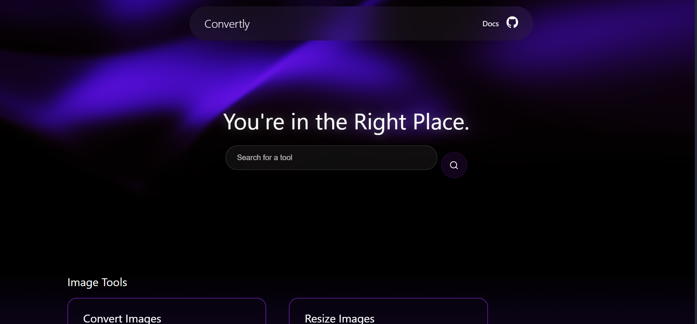

<!-- PROJECT LOGO -->
 

<h3 align="center">Convertly</h3>

  

    A full-stack media toolkit built with FastAPI and React, featuring batch image conversion/resizing, YouTube-to-MP3/MP4 extraction
     
    <a href="https://github.com/kaustubhdoval/convertly"><strong>Explore the docs »</strong></a>
     
     
    <a href="https://github.com/kaustubhdoval/convertly/issues">Report Bug</a>
    &middot;
    <a href="https://github.com/kaustubhdoval/convertly/issues">Request Feature</a>
  

<!-- ABOUT THE PROJECT -->

## About The Project

A full-stack web application built with FastAPI (Python) and React that provides a suite of media utilities:
 

<ul>
  <li>Batch Image Conversion (Supports PNG, JPG, ICO) </li>
  <li>Youtube to MP3/MP4</li>
  <li>Efficient File Handling - ZIP Packaging, Streaming Responses</li>
</ul>

## Run

To run the project locally in dev-mode, **cd into frontend**:  
`npm run dev`  
The existing start-dev.js file should startup both the backend and frontend services. The frontend should be available at `localhost:5173`

**To Run as a Docker Container**
Simply go to root directory and run `docker compose up` to build and run the container.
The Frontend Service will startup at `https://<container_computer>:3000` and the Backend API will be available at `https://<container_computer>:8000`

## Roadmap

<ul>
  <li>Get Metadata for Yt Downloads</li>
  <li>Better UI - more interactions for loading, processing etc. </li>
  <li>Cut down on dependencies</li>
</ul>

## Built With

[Laravel.com]: https://img.shields.io/badge/Laravel-FF2D20?style=for-the-badge&logo=laravel&logoColor=white
[Laravel-url]: https://laravel.com
[Bootstrap.com]: https://img.shields.io/badge/Bootstrap-563D7C?style=for-the-badge&logo=bootstrap&logoColor=white
[Bootstrap-url]: https://getbootstrap.com
[JQuery.com]: https://img.shields.io/badge/jQuery-0769AD?style=for-the-badge&logo=jquery&logoColor=white
[JQuery-url]: https://jquery.com
